# Snake Game Failure Testing and Reward Hacking with Reinforcement Learning

## Overview

This project implements a Snake game environment to explore how reward function design affects reinforcement learning agent behavior. Using both Tabular Q-Learning and Deep Q-Networks (DQN), it demonstrates how seemingly reasonable reward structures can produce unintended, broken, or degenerate policies, a phenomenon known as reward hacking.

The core thesis: an agent will always maximize the reward it is given, not necessarily the reward you intended to give it. Each failure case isolates a specific reward design mistake and shows its behavioral consequence in a controlled environment.

---

## Key Features

- **Custom Snake environment** built from scratch with configurable grid size, starvation limits, and mode-specific termination conditions
- **Tabular Q-Learning agent** using a dictionary-based Q-table, suitable for demonstrating how limited state representation causes failure
- **DQN agent** with experience replay, target network, and Huber loss for more capable baseline behavior
- **Multiple failure scenarios** each demonstrating a distinct reward design pitfall:
  - `failCase1` — Time-dependent rewards that the agent exploits by timing its behavior around reward windows
  - `failCase2` — Broken environment mechanics where the tail never removes, causing the snake to grow indefinitely
  - `failCase3` — Risk avoidance gone wrong, where an extreme death penalty causes the agent to play so conservatively it becomes ineffective
  - `failCase4` — Lazy agent, where a negligible food reward relative to step cost causes the agent to stall rather than seek goals
  - `failCase5` — Dense reward shaping that causes the agent to chase distance-to-food rather than actually collect it
- **GIF visualization** of full game episodes for qualitative analysis of agent behavior
- **Smoothed training graphs** of average reward and episode length across all training modes

---

## Installation

```bash
pip install numpy matplotlib torch pillow
```

For GPU acceleration on Apple Silicon:

```bash
pip install torch --index-url https://download.pytorch.org/whl/cpu
```

PyTorch will automatically use MPS if available.

---

## Usage

All configuration is handled through `config.py`. Set `ENV_MODE` to control which agent and scenario is run:

| Mode | Description |
|---|---|
| `train` | Train a DQN agent with standard rewards |
| `test` | Load a saved model and visualize a full game |
| `failCase1` | Fine-tune from train model with time-dependent rewards |
| `failCase2` | Train with broken tail removal mechanics | (plots and findings will be added in the future!)
| `failCase3` | Fine-tune from train model with extreme death penalty |
| `failCase4` | Fine-tune from train model with negligible food reward |
| `failCase5` | Fine-tune from train model with distance-based dense rewards |

Then run:

```bash
python main.py
```

Training plots are saved to `plots/` and models to `models/` as configured in `config.py`.

### Requirements

- Python 3.8+
- numpy
- torch
- matplotlib
- pillow

---

## Project Structure

```
├── main.py                  # Entry point, mode routing
├── env.py                   # Snake environment
├── dqn_agent.py             # DQN agent, replay buffer, network
├── tabular_q_learning_agent.py  # Tabular Q-learning agent
├── utils.py                 # Plotting and visualization
├── config.py                # All hyperparameters and paths
├── models/                  # Saved model weights
└── plots/                   # Training graphs and game GIFs
```
## Results

A reinforcement learning agent typically has one goal, to maximize total reward. 
A snake environment is a perfect example of this simple RL agent goal. The game can be boiled down to three simple instructions and few simple rules. 
With features indicating immediate danger, accessible space to avoid dead ends, the amount of spaces from any form of danger, and direction, a RL agent can quickly adopt the rules of Snake.

It can effectively and efficiently play the game much like we do, with some slight flaws in its gameplay. 
I have implemented a Deep Q-Network (DQN) neural net system in order to develop and effective Snake player. 
As the game gets longer, the agent does present certain struggles, but with more training, it will get more experienced and trend more towards max length episodes and higher reward.
We can see this general upward trend in Fig. 1 and 2, where reward and episode length still have room to grow and improve.

<p align="center">
  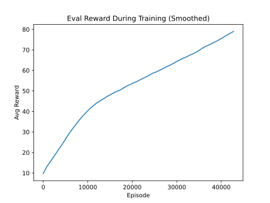
  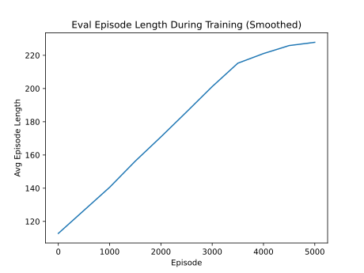
</p>
<p align="center"><em>Figure 1: Average reward and episode length during baseline training.</em></p>

<p align="center">
  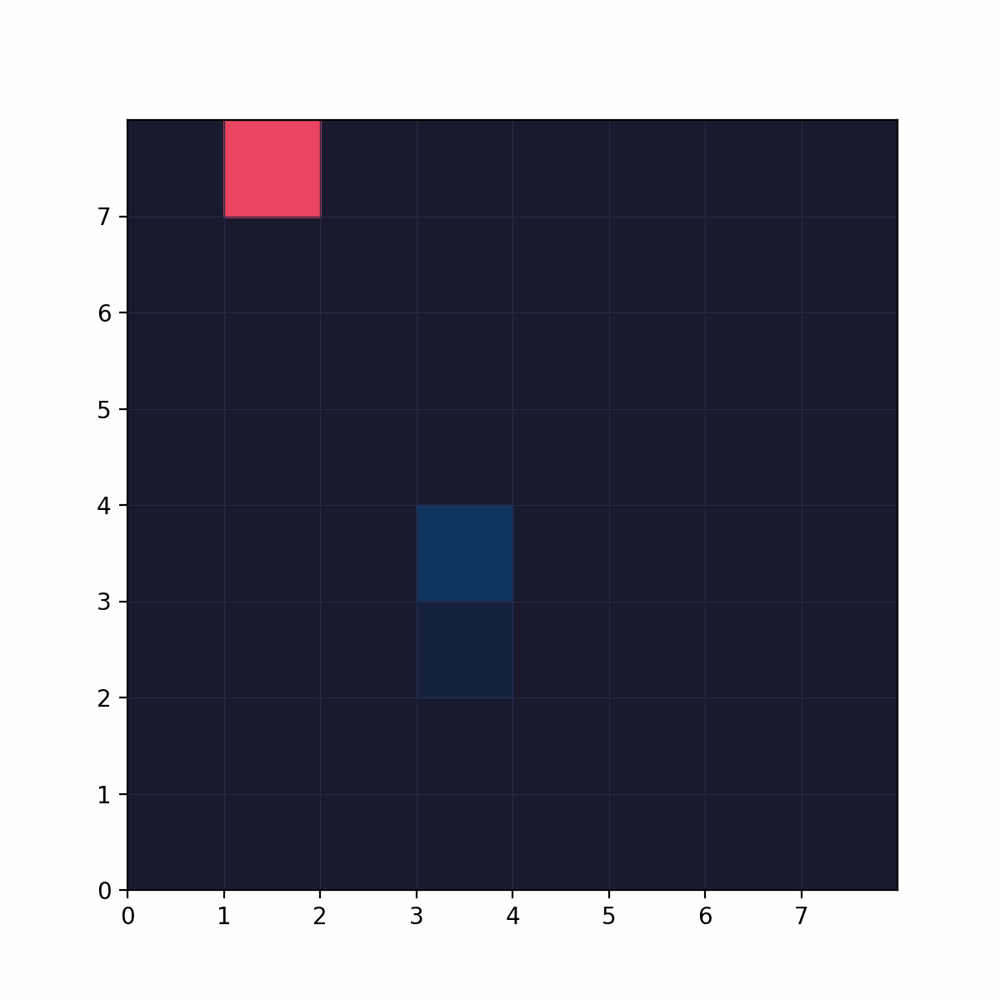
  <br>
  <em>Figure 2: Baseline agent gameplay.</em>
</p>

However, the flexibility of the Snake as an environment enables much exploration with unique reward structures and scenarios. 
Ultimately, higher reward is the goal of the agent. As such, reinforcing an existing model with a new environment provides an interesting experiment of how such an agent will adapt to the new rules.
In the 1st fail case, my goal with the reward structure was to explore temporal reward shaping, exploiting a time-dependent reward structure rather than learning the intended behavior. 
This demonstration points to the fact that agents optimize the literal reward function, not the designer's intent.
Faced with negative reinforcement when trying to get fruits in early and late scenarios, the agent optimized the reward function.
It has learned to now stall out in the beginning, and preemptively end the game in adaptation to the new policy. 
This is in contrast to Snake's primary goal, getting as many fruits as possible and maximizing score. The reward system of the agent has functionally been hacked, changing the measures of game quality.
This is a direct example of Goodhart's Law: when a measure becomes a target, it ceases to be a good measure.

<p align="center">
  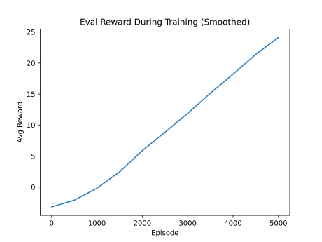
  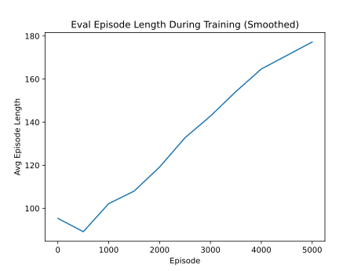
</p>
<p align="center"><em>Figure 3: Average reward and episode length during failCase1 training.</em></p>

<p align="center">
  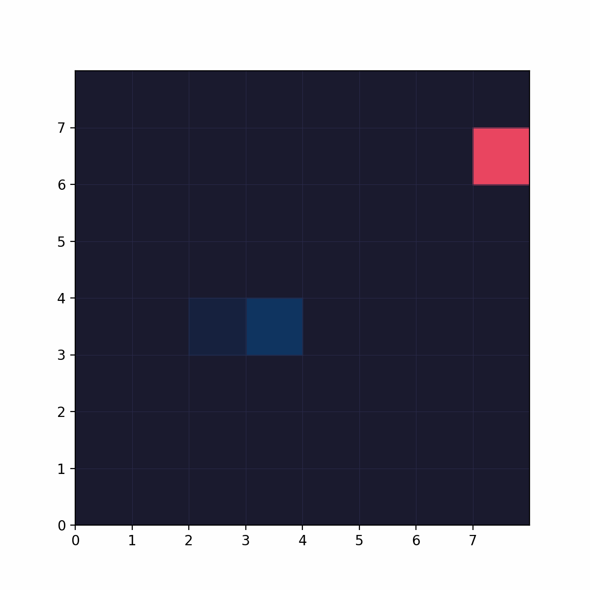
  <br>
  <em>Figure 4: Agent exploiting the timestep reward window.</em>
</p>

In addition, I was also curious about how scaling rewards and introducing a general penalty dominance would affect the agent's game strategy. With my configuration, food providing a reward of +10 and dying a reward of -100, the penalty now significantly dominates food rewards by 10x.
When one reward signal is orders of magnitude larger than others, it drowns out all other learning signals. Although it is still possible to end with a strongly positive reward, as seen in the eval reward in initial episodes, the agent still changes its strategy.
The strongly negative signal has caused the agent to play more safely, taking inefficient paths which are risk averse. 
The goal in turn has shifted from maximizing score to reward maximization by avoiding taking any risks. 
This agent shows the importance of reward normalization and relative reward magnitude in multi-objective reward design, as imbalanced rewards result in an agent which may be unable to converge toward the goal of maximizing the score, becoming stuck in local optimums under and ineffective policy.
This illustrates that reward magnitude matters as much as reward structure; an imbalanced signal can corrupt an otherwise sound policy.

<p align="center">
  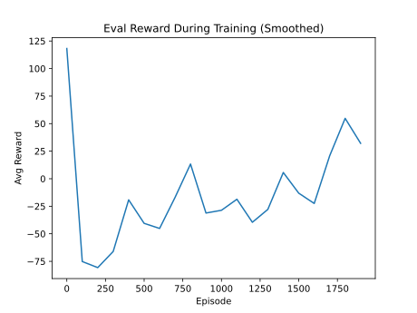
  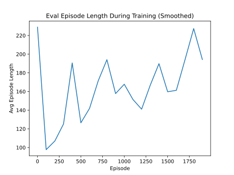
</p>
<p align="center"><em>Figure 7: Average reward and episode length during failCase3 training.</em></p>

<p align="center">
  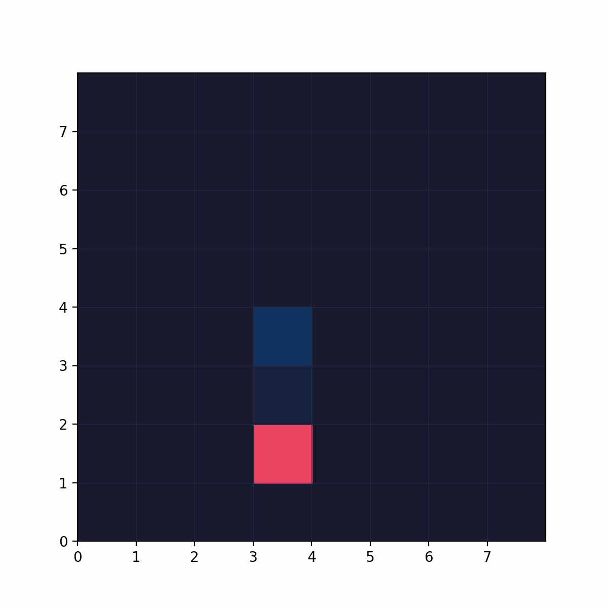
  <br>
  <em>Figure 8: Agent taking extreme detours to avoid risk.</em>
</p>

In the 4th fail case, I wanted to explore how weak reward signals collapse the exploration-exploitation balance. With a step penalty of -0.1 and a food reward of only +0.5, the agent needs to reach food within 5 steps just to break even which is impossible on an 8x8 grid where food can spawn up to 14 Manhattan steps away. Beyond that range, actively seeking food is a net loss. Starvation termination was also disabled for this case, removing the only remaining incentive to move at all.

The result is an agent that correctly identifies doing nothing as the locally optimal policy; it avoids death to sidestep the -10 penalty, but treats food as not worth pursuing. 
Looking for a fruit will always produce an overwhelmingly negative reward. The agent realizes that getting fruit is pointless, and the agent will exploit inaction rather than explore for better outcomes.
Although it is possible for rewards to be less negative like in the initial 250 episodes, the agent still prioritizes laziness.
This example goes to show the importance of positive reinforcement for exploration-exploitation. 
When rewards are too sparse and too weak, exploration for less negative rewards is undervalued.


<p align="center">
  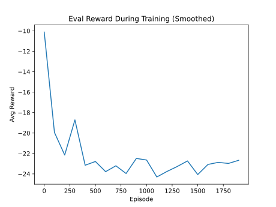
  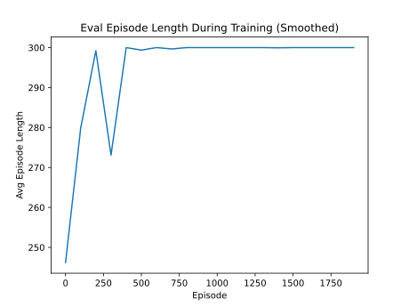
</p>
<p align="center"><em>Figure 9: Average reward and episode length during failCase4 training.</em></p>

<p align="center">
  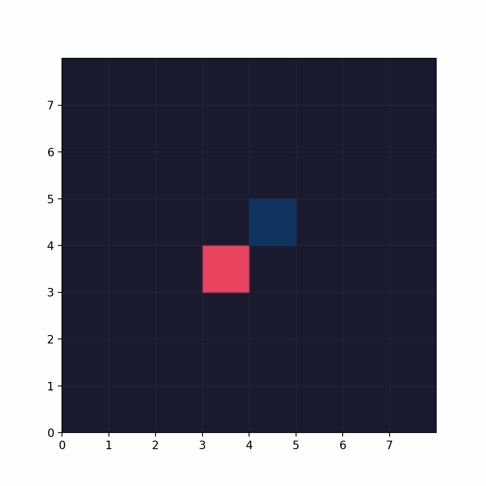
  <br>
  <em>Figure 10: Agent stalling rather than navigating toward food.</em>
</p>

Lastly, I wanted to introduce a new reward metric, to demonstrate that currently, the agent in this environment just chases reward over optimum policy.
As such, I added getting closer to the fruit as an element of the design structure. Dense reward shaping is a common technique to speed up learning by rewarding progress toward a goal.
This is an effective training idea, as the agent will learn significantly quicker and chase a proper goal. 
However, if the shaped reward is not perfectly aligned with the true objective the agent exploits the proxy instead.
Case 5 shows proxy gaming, where optimizing a measurable proxy diverges from the true goal. 
As such, the agent likes to loop around in circles around the fruit, chasing the proxy as that yields more immediate and higher reward. 
You can reward getting closer to the goal, as it is an effective teaching/learning strategy, but it must be done in a way in which the reward for reaching a goal still significantly outweighs the reward for stepping closer to the goal.

<p align="center">
  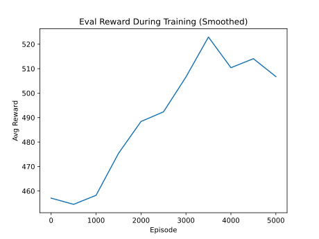
  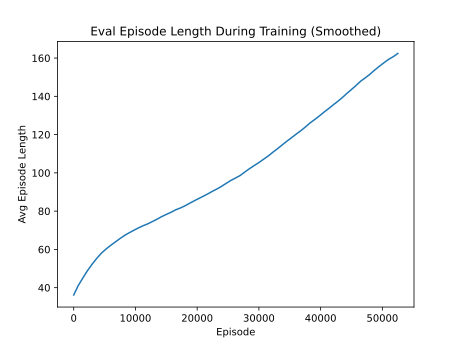
</p>
<p align="center"><em>Figure 11: Average reward and episode length during failCase5 training.</em></p>

<p align="center">
  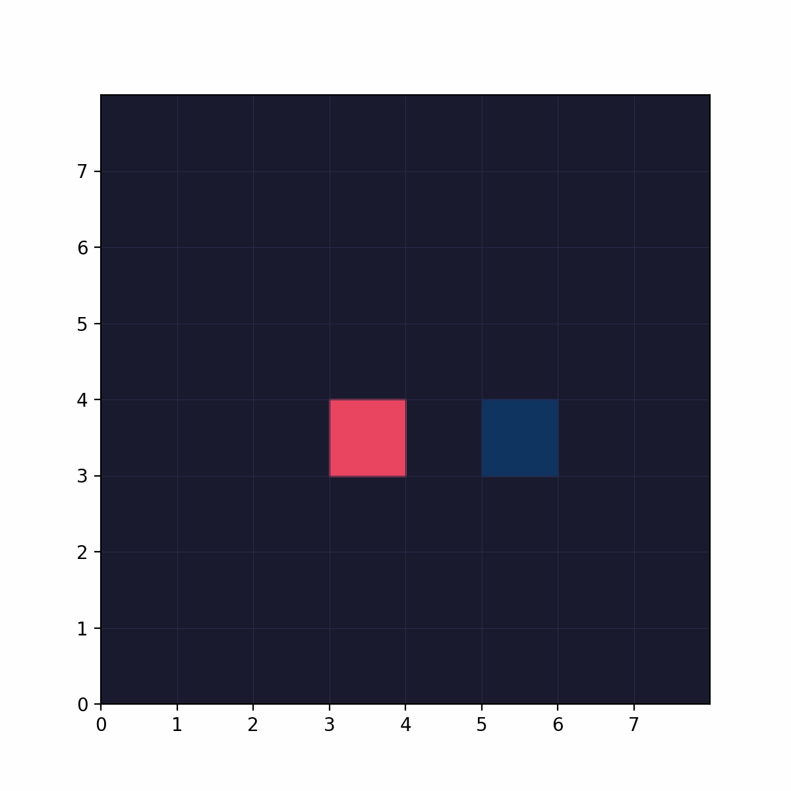
  <br>
  <em>Figure 12: Agent exploiting distance-based shaping reward.</em>
</p>
